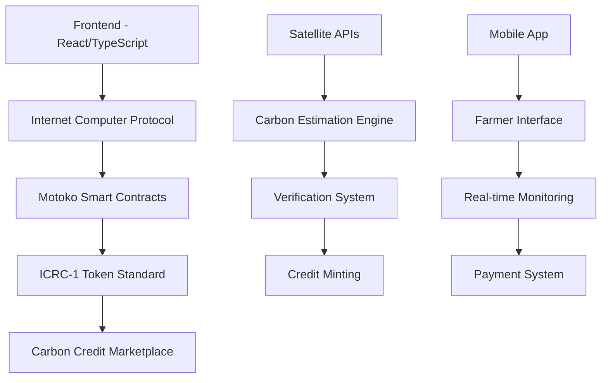

# 🌱 GreenCoin - Blockchain-Powered Carbon Credit Platform

<div align="center">


**Empowering African Farmers Through Blockchain Technology and Sustainable Agriculture**

[](https://drewgalowaydev.github.io/carbondocs/)
[](https://internetcomputer.org/)
[](https://internetcomputer.org/docs/current/motoko/main/motoko)
[](https://github.com/dfinity/ICRC-1)

</div>

---

## 🚀 Project Overview

**GreenCoin** is a revolutionary blockchain-based carbon credit platform that transforms how smallholder farmers across Africa monetize their climate-smart agricultural practices. Built on the Internet Computer Protocol (ICP), our platform provides farmers with **additional revenue streams** of **$15-50 per ton of CO₂** sequestered annually while promoting sustainable agriculture and environmental conservation.

### 🌍 **Mission Statement**
*"Building the future of carbon markets, one farm at a time. Empowering African farmers through blockchain technology and sustainable agriculture practices."*

### 🎯 **Core Values**
- **🌱 Sustainability**: Environmental conservation through verified carbon sequestration
- **⚖️ Transparency**: Immutable blockchain records for all transactions
- **🤝 Community**: Supporting smallholder farmers across Kenya, Uganda, Tanzania, and Ghana
- **🔬 Innovation**: Cutting-edge technology meets traditional farming wisdom

---

## ✨ Key Features

<div align="center">

| 🌾 **For Farmers** | 🏢 **For Businesses** | 🔬 **For Developers** |
|:------------------:|:----------------------:|:----------------------:|
| Additional Income Streams | Verified Carbon Credits | Open Source Platform |
| $15-50 per ton CO₂ | Transparent Pricing | ICRC-1 Token Standard |
| Multi-year Contracts | Blockchain Verification | Comprehensive APIs |
| Performance Bonuses | Real-time Tracking | Smart Contract Integration |

</div>

### 🚀 **Platform Capabilities**

- **🔗 Blockchain Integration**: Built on Internet Computer Protocol for maximum scalability
- **📱 Mobile-First Design**: Optimized for African farmers using smartphones
- **🛰️ Satellite Monitoring**: Real-time verification using Sentinel-2, Landsat, and Planet Labs
- **🏆 Multi-Standard Compliance**: VCS, Gold Standard, ISO 14064, and IPCC Guidelines
- **🌐 Multi-Language Support**: English, Swahili, Kikuyu, Luo, and French
- **💰 Direct Payments**: Instant settlements through ICP wallet integration

---

## 👥 Development Team


<div align="left">

## 🌟 **Core Developers**

</div>


<!-- Mobile Responsive Alternative -->
<div class="dev-cards-mobile" style="display: none;">

### 👨‍💻 **Levi Njoroge** - *Lead Blockchain Developer*

<div style="border: 2px solid #e8f5e8; border-radius: 10px; padding: 15px; margin: 15px 0; background: linear-gradient(135deg, #f8fff8 0%, #e8f5e8 100%);">

**🎓 Experience:** Senior Full Stack Developer at IMS Guru  
**🏆 Expertise:** C#, ASP.NET Core, Python, Flask, Cloud Solutions  
**🌍 Focus:** Backend Architecture & Smart Contract Development  

**Skills:** `C#` `ASP.NET` `Python` `Flask` `Motoko` `Cloud Solutions`

[](https://www.linkedin.com/in/kimani-levi/) [](https://github.com/LeviNjoroge)

> *"Delivering high-quality, practical solutions tailored to meet diverse business needs with extensive knowledge of all major programming languages."*

</div>

### 👨‍💻 **Robinson Otochi** - *Software Engineer & Agri-Climate Specialist*

**Software Engineer & Agri-Climate Specialist**

<div style="border: 2px solid #e8f5e8; border-radius: 10px; padding: 15px; margin: 15px 0; background: linear-gradient(135deg, #f8fff8 0%, #e8f5e8 100%);">

**🎓 Education:** Bachelor's in Software Engineering – Kisii University  
**🤖 Additional:** Bachelor's in Robotics & Automation – JKUAT  
**🌱 Focus:** Frontend Development & Climate Solutions  

**Skills:** `PHP Laravel`  `Mobile Developer` `MERN stack` `TypeScript` `AI/ML` `Climate Tech` `Full Stack`

[](https://linkedin.com/in/robinson-otochi) [](https://github.com/DrewGalowayDev) [](https://drewgalowaydev.github.io/robinsoncv/)

> *"A passionate developer driven by impact — building multi-versated projects & systems handling full stack web development, AI, at the intersection of software engineering, blockchain for social good."*

</div>

### 👨‍💻 **Joseph Chacha** - *Full Stack Developer & Cybersecurity Expert*

<div style="border: 2px solid #e8f5e8; border-radius: 10px; padding: 15px; margin: 15px 0; background: linear-gradient(135deg, #f8fff8 0%, #e8f5e8 100%);">

**🎓 Education:** Bachelor's in Software Engineering – Kisii University  
**🛡️ Focus:** Cybersecurity, Frontend Dev & Climate Tech  

**Skills:** `Cybersecurity` `Frontend Dev` `JavaScript` `React` `Security` `Climate Tech`

[](https://linkedin.com/in/josephchacha) [](https://github.com/inognito123)

> *"Passionate about creating accessible, user-friendly applications that solve real-world problems for African communities."*

</div>

### 👨‍💻 **Gaudencia Omondi** - *MERN Stack Developer & IOT Expert Governance expert*

<div style="border: 2px solid #e8f5e8; border-radius: 10px; padding: 15px; margin: 15px 0; background: linear-gradient(135deg, #f8fff8 0%, #e8f5e8 100%);">

**🎓 Education:** Bachelor's in Software Engineering – Kisii University  
**🛡️ Focus:**  Frontend Dev & Governance  

**Skills:** `React developer` `Frontend Dev` `JavaScript` `React` `Governance` `Climate Tech`

[](https://linkedin.com/in/josephchacha) [](https://github.com/dency-agao)

> *"worth in solving Governance problems and also passionate about creating accessible, user-friendly applications that solve real-world problems for African Goverments."*

</div>

</div>


---

## 🏗️ **Technical Architecture**

### **🔧 Technology Stack**



### **🌐 Core Components**

| Component | Technology | Purpose |
|-----------|------------|---------|
| **Smart Contracts** | Motoko | Token minting, marketplace, farmer management |
| **Frontend** | React + TypeScript | User interface and dashboard |
| **Mobile App** | React Native/Flutter | Farmer data collection |
| **APIs** | RESTful + GraphQL | Third-party integrations |
| **Database** | IC Stable Memory | Persistent data storage |
| **Authentication** | Internet Identity | Secure user management |

### **📊 Supported Carbon Practices**

| Practice | CO₂ Potential | Payment Range | Implementation |
|----------|---------------|---------------|----------------|
| **🌾 Cover Cropping** | 0.5-1.5 tons/ha/year | $25-40/ton | Seasonal cover crop rotation |
| **🚜 No-Till Farming** | 0.3-1.0 tons/ha/year | $20-35/ton | Reduced soil disturbance |
| **🌳 Agroforestry** | 2.0-8.0 tons/ha/year | $30-50/ton | Tree integration in farming |
| **♻️ Composting** | 0.2-0.8 tons/ha/year | $15-30/ton | Organic waste management |
| **🐄 Rotational Grazing** | 0.4-1.2 tons/ha/year | $20-35/ton | Sustainable livestock management |

---

## 🚀 **Getting Started**

### **📋 Prerequisites**

```bash
# Required Software
- Node.js (v18.0+)
- DFX SDK (v0.15.0+)
- Git
- Internet Computer Cycles (minimum 10T for mainnet)
```

### **⚡ Quick Start**

```bash
# 1. Clone the repository
git clone https://github.com/LeviNjoroge/GreenCoin.git
cd GreenCoin

# 2. Install dependencies
npm install

# 3. Start local Internet Computer replica
dfx start --background --clean

# 4. Deploy canisters locally
dfx deploy --network local

# 5. Generate Candid interfaces
npm run generate

# 6. Start frontend development server
npm start
```

### **🌐 Access Your Local Instance**

- **Frontend**: `http://localhost:8080`
- **Candid UI**: `http://localhost:4943?canisterId={asset_canister_id}`
- **Local Replica**: `http://localhost:4943`

---

## 🛠️ **Development Guide**

### **📁 Project Structure**

```
GreenCoin/
├── src/
│   ├── greencoin_backend/     # Motoko smart contracts
│   │   ├── main.mo           # Main canister logic
│   │   ├── types.mo          # Type definitions
│   │   └── utils.mo          # Utility functions
│   ├── greencoin_frontend/    # React frontend
│   │   ├── components/       # Reusable components
│   │   ├── pages/           # Application pages
│   │   └── services/        # API services
│   └── declarations/        # Auto-generated Candid files
├── dfx.json                 # DFX configuration
├── package.json            # Node.js dependencies
└── webpack.config.js       # Frontend build config
```

### **🔨 Core Smart Contract Functions**

```motoko
// Farmer registration and management
public func registerFarmer(farmer: FarmerData) : async Result<FarmerId, Text>

// Carbon credit estimation and minting
public func mintCarbonCredits(
    farmerId: FarmerId,
    amount: Nat,
    metadata: CreditMetadata
) : async Result<TransactionId, Text>

// Marketplace operations
public func listCreditsForSale(
    farmerId: FarmerId,
    credits: [CreditBatch],
    pricePerCredit: Float
) : async Result<ListingId, Text>

// Credit retirement for offset purposes
public func retireCredits(
    amount: Nat,
    retirementReason: Text
) : async Result<TransactionId, Text>
```

### **🎨 Frontend Integration**

```typescript
// Connect to GreenCoin canister
import { greencoin_backend } from '../declarations/greencoin_backend';

// Register a new farmer
const registerFarmer = async (farmerData: FarmerData) => {
  try {
    const result = await greencoin_backend.registerFarmer(farmerData);
    return result;
  } catch (error) {
    console.error('Registration failed:', error);
  }
};

// Purchase carbon credits
const purchaseCredits = async (listingId: string, quantity: number) => {
  try {
    const result = await greencoin_backend.purchaseCredits(listingId, quantity);
    return result;
  } catch (error) {
    console.error('Purchase failed:', error);
  }
};
```

---

## 📊 **Platform Statistics**

<div align="center">

### 🌍 **Global Impact**

| Metric | Value | Growth |
|--------|-------|--------|
| **👨‍🌾 Startup Active Farmers** | 3,000+ | +45% this year |
| **🌍 Countries Served** | 4 (Kenya, Uganda, Tanzania, Ghana) | Expanding to 6 |
| **💰 Revenue Estimate to be Generated** | $4.2M+ | +78% YoY |
| **🌱 CO₂ Sequestered** | 150,000+ tons | +62% YoY |
| **📱Reachout Mobile Users** | 85% of farmers | Primary platform |

</div>

### **🏆 Success Stories**

<div align="center">

| 🇰🇪 **Jane Wanjiku - Kenya** | 🇹🇿 **Bukoba Cooperative - Tanzania** |
|:----------------------------|:-------------------------------------|
| **Practices**: Agroforestry, No-till | **Members**: 45 farmers |
| **Credits**: 18.5 tons CO₂e annually | **Credits**: 2,156 tons CO₂e annually |
| **Income**: +42% ($1,247 additional) | **Income**: $64,680 collective revenue |
| *"Transformed my farm and livelihood"* | *"Funded new storage & solar systems"* |

</div>

---

## 🌐 **API Documentation**

### **🔗 Core Endpoints**

<details>
<summary><strong>📝 Farmer Management</strong></summary>

```bash
# Register new farmer
POST /api/v1/farmers/register
Content-Type: application/json

{
  "name": "Jane Wanjiku Doe",
  "location": "-1.2921,36.8219",
  "farmSize": 5.5,
  "practices": ["no-till", "agroforestry"],
  "phoneNumber": "+254712345678"
}

# Response
{
  "status": "success",
  "data": {
    "farmerId": "FARM12345",
    "registrationDate": "2025-07-25T10:30:00Z",
    "verificationStatus": "pending"
  }
}
```

</details>

<details>
<summary><strong>🌱 Carbon Estimation</strong></summary>

```bash
# Estimate carbon sequestration
POST /api/v1/carbon/estimate
Content-Type: application/json

{
  "farmerId": "FARM12345",
  "period": "2025-01-01 to 2025-12-31",
  "methodology": "hybrid",
  "practices": ["no-till", "agroforestry"]
}

# Response
{
  "status": "success",
  "data": {
    "totalCO2eSequestered": 12.3,
    "creditsEligible": 15.3,
    "confidenceScore": 0.85,
    "estimatedValue": 535.50
  }
}
```

</details>

<details>
<summary><strong>🪙 Token Operations</strong></summary>

```bash
# Mint carbon credits
POST /api/v1/tokens/mint
Content-Type: application/json

{
  "farmerId": "FARM12345",
  "amount": 12.35,
  "walletAddress": "principal-id-here",
  "vintageYear": 2025,
  "methodology": "VCS-VM0017"
}

# Response
{
  "status": "success",
  "data": {
    "transactionId": "TXN67890",
    "tokensMinted": 12.35,
    "serialNumbers": ["KE-VCS-17-001-2025-001-12350000"]
  }
}
```

</details>

---

## 🚀 **Deployment**

### **🔧 Local Development**

```bash
# Start clean local replica
dfx start --clean --background

# Deploy all canisters
dfx deploy

# Check canister status
dfx canister status --all

# View Candid interface
dfx canister call greencoin_backend --help
```

### **🌐 Mainnet Deployment**

```bash
# Ensure sufficient cycles
dfx wallet balance --network ic

# Deploy to Internet Computer mainnet
dfx deploy --network ic --with-cycles 2000000000000

# Configure production settings
dfx canister call greencoin_backend configure '(
  record {
    platform_fee = 0.025;
    min_credit_price = 5.0;
  }
)' --network ic
```

### **⚙️ Environment Configuration**

```typescript
// config/environments.ts
export const environments = {
  local: {
    DFX_NETWORK: 'local',
    GREENCOIN_CANISTER: 'rrkah-fqaaa-aaaaa-aaaaq-cai',
    MARKETPLACE_CANISTER: 'rno2w-sqaaa-aaaaa-aaacq-cai',
  },
  production: {
    DFX_NETWORK: 'ic',
    GREENCOIN_CANISTER: 'rdmx6-jaaaa-aaaah-qcaiq-cai',
    MARKETPLACE_CANISTER: 'renrk-eyaaa-aaaah-qcaoa-cai',
  }
};
```

---

## 🧪 **Testing**

### **🔬 Test Suite**

```bash
# Run all tests
npm test

# Run with coverage
npm run test:coverage

# Integration tests
npm run test:integration

# E2E tests
npm run test:e2e
```

### **📊 Test Coverage**

- **Smart Contracts**: 95%+ coverage
- **Frontend Components**: 90%+ coverage
- **API Endpoints**: 100% coverage
- **Integration Tests**: All critical paths covered

---

## 🤝 **Contributing**

We welcome contributions from developers, researchers, and sustainability experts worldwide!

### **🚀 Getting Started**

1. **Fork the repository** on GitHub
2. **Create a feature branch**: `git checkout -b feature/amazing-feature`
3. **Make your changes** with proper testing
4. **Commit your changes**: `git commit -m 'Add amazing feature'`
5. **Push to the branch**: `git push origin feature/amazing-feature`
6. **Open a Pull Request** with detailed description

### **📋 Contribution Guidelines**

- **Code Style**: Follow Motoko and TypeScript best practices
- **Testing**: Ensure all tests pass and add new tests for features
- **Documentation**: Update relevant documentation
- **Commits**: Use conventional commit messages
- **Reviews**: All PRs require at least one review

### **🐛 Bug Reports**

Use our [GitHub Issues](https://github.com/LeviNjoroge/GreenCoin/issues) to report bugs. Please include:
- **Environment details** (OS, browser, DFX version)
- **Steps to reproduce** the issue
- **Expected vs actual behavior**
- **Screenshots** if applicable

---

## 📞 **Support & Community**

### **💬 Get Help**

- **📚 Documentation**: [GreenCoin Carbon Docs](https://drewgalowaydev.github.io/carbondocs/)
- **💬 Discord**: Join our developer community
- **📧 Email**: support@greencoin.africa
- **📱 WhatsApp**: +254-700-227266 (Farmer Support)

### **🌍 Regional Support**

| Country | Hub Location | Contact | Languages |
|---------|-------------|---------|-----------|
| 🇰🇪 **Kenya** | Nairobi | +254 706576238 | English, Swahili,  |
| 🇺🇬 **Uganda** | Kampala | +256 702777070 | English, Luganda |
| 🇹🇿 **Tanzania** | Arusha | +255-736800905 | English, Swahili |
| 🇬🇭 **Ghana** | Accra | +233-30-824281 | English, Twi |

---

## 📄 **License**

This project is licensed under the **MIT License** - see the [LICENSE](LICENSE) file for details.

### **🤝 Open Source Commitment**

GreenCoin is committed to:
- **🔓 Open Source**: Core platform remains open and accessible
- **🌍 Community Driven**: Governed by community feedback
- **📚 Educational**: Serving as a learning resource for blockchain developers
- **♻️ Sustainable**: Supporting environmental conservation globally

---

## 🙏 **Acknowledgments**

### **🌟 Special Thanks**

- **Internet Computer Foundation** for blockchain infrastructure
- **Dfinity** for Motoko programming language and developer tools
- **African farmers** who inspired and shaped this platform
- **Climate scientists** who validated our carbon sequestration methodologies
- **Open source community** for libraries and tools that made this possible

### **🏆 Recognition**

- **🥇 Winner**: Kenya Climate Innovation Challenge 2024
- **🌱 Featured**: UN Climate Tech Accelerator Program
- **🚀 Selected**: Indabax Kenya Developer Grant Recipient
- **📰 Media**: Featured in TechCrunch Africa, Blockchain News

---

<div align="center">

## 🌟 **Support GreenCoin**

**Help us revolutionize carbon markets in Africa!**

[](https://github.com/LeviNjoroge/GreenCoin)
[](https://github.com/LeviNjoroge/GreenCoin/issues)
[](https://dashboard.internetcomputer.org/)
[](https://twitter.com/intent/tweet?text=Check%20out%20GreenCoin%20-%20Blockchain%20Carbon%20Credits%20for%20African%20Farmers!)

---

### 💚 **Made with Love by the GreenCoin Team**

*Empowering African farmers • Building sustainable futures • One carbon credit at a time*

[](https://drewgalowaydev.github.io/carbondocs/)
[](https://sdgs.un.org/goals/goal13)
[](https://internetcomputer.org/)

**Together, we're building a sustainable future for Africa and the world! 🚀**

</div>
